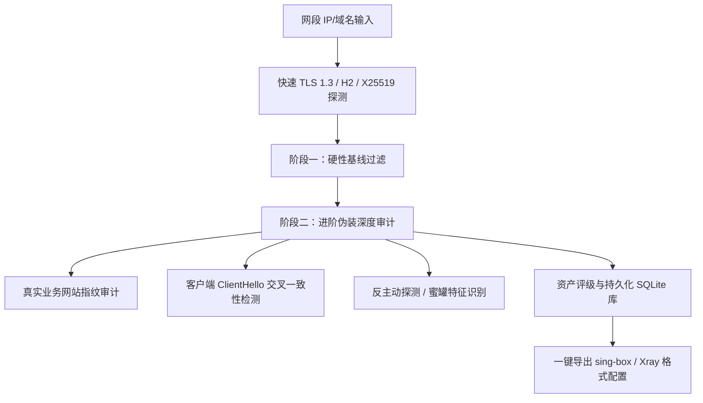

对当前 `RealityChecker` 项目的代码结构、并发流水线、检测逻辑与资产存储进行深度分析后，梳理出以下**现状评估、可优化缺陷/瓶颈点**，以及**演进方向与落地规划**：

---

### 一、 核心架构全景透视

当前项目形成了较为完整的 REALITY 自动化选型链路：
1. **网络与扫描层**：[`scanner.Scanner`](file:///c:/Users/Ryu/Documents/workspace/RealityChecker/internal/scanner/scanner.go#L19-L35) 负责并发 CIDR 探测，支持 `SetLinger(0)` 快速释放端口，提取证书 SAN/CN；
2. **调度与流水线**：[`core.AutoScanner`](file:///c:/Users/Ryu/Documents/workspace/RealityChecker/internal/core/auto_scanner.go#L60-L79) 负责流式分发、断点进度追踪（Checkpoint）、动态 Worker 池；[`core.Pipeline`](file:///c:/Users/Ryu/Documents/workspace/RealityChecker/internal/core/pipeline.go#L15-L35) 负责两阶段（硬性技术基线 + 进阶偏好过滤）分步检测；
3. **数据资产层**：[`storage.TargetStore`](file:///c:/Users/Ryu/Documents/workspace/RealityChecker/internal/storage/store.go#L18-L23) 使用 SQLite (WAL 模式) 实现全量扫描的资产沉淀与精确 IP 断点续传；
4. **外部集成**：[`asn.Client`](file:///c:/Users/Ryu/Documents/workspace/RealityChecker/internal/asn/asn.go#L18-L34) 对接 RIPE Stat API，结合 MaxMind GeoIP (`Country.mmdb`) 实现了“IP -> ASN -> 国家前缀 -> 自动化扫描”的闭环。

---

### 二、 当前代码存在的痛点与优化点 (Code-Level Optimizations)

#### 1. 并发安全与数据竞争隐患 (Race Condition) - [x] 已落地
- **`Pipeline` 中并发阶段的数据竞争**（已修复）：按优先级严格串行执行各检测阶段，彻底根除读写竞争；
- **Channel 饱和时无节制创建临时 Goroutine**（已修复）：统一为标准阻塞 Backpressure 写入。

#### 2. 网络握手冗余与性能翻倍机会
- **综合 TLS 检测中的二次握手冗余** - [x] 已落地：首轮握手若协商为 X25519 族系直接复用结果，省去第二次全握手；
- **DNS 解析与连接复用缺乏缓存** - [ ] 待规划推进。

#### 3. 独立且残缺的 `ConnectionManager` 模块 - [x] 已落地
- 已全面移除空轮询伪连接池；
- 全面改用 `DialContext(ctx)` 与 `HandshakeContext(ctx)` 实现 Context 超时即时感知；
- 连接关闭均设置 `SetLinger(0)`，与 `scanner.go` 保持高并发端口快速释放标准。

#### 4. 二进制独立分发与资源内嵌 (`go:embed`) - [ ] 待规划推进
- 当前 `data/gfwlist.conf`、`data/hot_websites.txt`、`data/cdn_keywords.txt`、`data/exclude_rules.txt` 均以相对路径硬编码；
- 建议使用 Go 1.16+ `embed.FS` 将默认规则文件静态打包进二进制可执行程序。

#### 5. 代码重复与架构规整 (DRY 原则)
- **星级计算重复** - [x] 已落地：统一委托至 `core.CalculateTargetStars`；
- **批处理和管道逻辑统一** - [ ] 待规划推进。

---

### 三、 业务与伪装检测能力演进 (REALITY Domain Deepening)

REALITY 协议的核心是**“天衣无缝的借鸡生蛋”**。一个优质的 REALITY 伪装目标，不仅仅是满足技术基线，更在于**抵御审查机构的主动探测和行为特征分析**。建议在检测深度上进一步演进：

1. **真实业务网站指纹深度识别 (Active Camouflage Fingerprinting)**：
   - 当前已支持检测 Nginx 默认页与短回显 Dummy 服务，建议进一步增加：
     - **页面信息熵与静态资源检测**：真实网站通常包含 favicon.ico、外部 CSS/JS 资源引用、合理的 DOM 层级；而很多扫描出来的域名实际是空机、停放域名（Domain Parking）或仅有简单报错；
     - **动态证书重定向校验**：部分域名在访问 HTTP 时跳转到其他完全无关的域名，或者其 SAN 证书虽然匹配，但根证书是 Untrusted/Self-Signed。
2. **TLS 握手特征与主流浏览器契合度 (TLS Extension Parity)**：
   - 检查目标服务器是否支持 **Session Ticket / 0-RTT**、**OCSP Stapling** 等现代浏览器常见的特性；
   - 目标如果支持的密码套件极其古老或行为怪异，在面对 GFW 的深度包检测（DPI）重放攻击时容易暴露。
3. **反蜜罐/主动探测陷阱识别 (Honeypot Identification)**：
   - 部分高危 IP 会部署特定探针，对所有 SNI 均返回特定证书或固定伪造页面。可引入“随机非法 SNI 探测法”：向目标发送一个随机不存在的主机名，若其依然返回特定 200 正常页面，说明是泛反向代理或捕获蜜罐，应予以扣分或排除。

---

### 四、 系统与产品形态演进方向 (Evolution Roadmap)

| 维度　　　　　 | 演进方向　　　　　　　　　　　　　　| 具体功能与价值　　　　　　　　　　　　　　　　　　　　　　　　　　　　　　　　　　　　　　　　　　　　　　　　　　　　　　　　　　　　　　　　　　　　　　　　　　　　　　　　　　　　　|
| :---------------| :------------------------------------| :----------------------------------------------------------------------------------------------------------------------------------------------------------------------------------------|
| **资产管理**　 | **本地资产库 CLI 交互化**　　　　　 | 新增 `reality-checker list` / `reality-checker db` 命令，支持按星级、ASN、国家、延迟对已入库的几万条资产进行离线即时筛选、删除过期资产。　　　　　　　　　　　　　　　　　　　　　　　　|
| **生态打通**　 | **一键生成代理客户端配置**　　　　　| 新增 `--format singbox`、`--format xray`、`--format clash`，扫描到目标后自动生成可直接导入的 `outbounds` 配置（甚至自动填入随机生成的 `uuid`、`short_id` 与可用真实目标）。　　　　　　 |
| **性能跃迁**　 | **SYN 快速预筛选 + 异步 TLS 握手**　| 目前全靠全握手，扫描大网段（如 `/16` 有 65536 个 IP）仍需一定时间。可引入可选的轻量 SYN 预探机制（类似 ZMap），先探测 443 是否开放，再针对开放 IP 触发深度 TLS 检测，速度可提升数十倍。 |
| **自动化运维** | **资产健康巡检守护进程 (Watchdog)** | REALITY 目标具有时效性（如证书到期、服务器搬迁、IP 被墙）。可支持 `reality-checker patrol` 模式，定时对本地资产库进行存活与证书更新检测，自动淘汰失效目标。　　　　　　　　　　　　　　 |
| **接口化服务** | **Headless / RESTful API 模式**　　 | 将核心检测引擎暴露为 HTTP/gRPC API，便于作为下游工具（如节点管理面板、自动化部署脚本、订阅转换器）的基础后端服务。　　　　　　　　　　　　　　　　　　　　　　　　　　　　　　　　　　　|

---

### 五、 落地优先级建议

1. **P0（稳定性与性能即时见效）**：
   - 消除 [`comprehensive_tls.go`](file:///c:/Users/Ryu/Documents/workspace/RealityChecker/internal/detectors/comprehensive_tls.go#L91-L96) 中的冗余第二次握手，首轮握手命中 X25519 即直接复用结果；
   - 修复 [`pipeline.go`](file:///c:/Users/Ryu/Documents/workspace/RealityChecker/internal/core/pipeline.go#L132-L170) 的并发写竞争，将纯内存的 `HotWebsiteStage` 调整为串行快速检测；
   - 解决 [`auto_scanner.go`](file:///c:/Users/Ryu/Documents/workspace/RealityChecker/internal/core/auto_scanner.go#L365-L375) 无界开协程导致的潜在泄漏隐患。
2. **P1（便携性与可用性）**：
   - 引入 `//go:embed` 打包 `data/` 目录默认规则文件，支持独立二进制全局调用；
   - 统一 `batch` 与 `core` 的星级评分与过滤方法（消除重复代码） - [x] 已落地。
3. **P2（功能拓展与生态集成）**：
   - 支持直接导出 sing-box / Xray 的 JSON 配置片段；
   - 增加 SQLite 本地目标资产的查询/导出子命令。